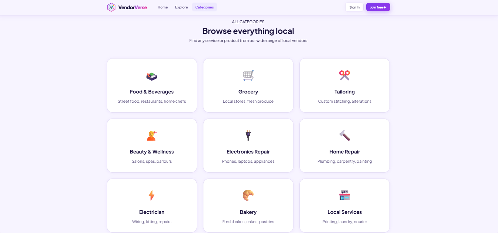
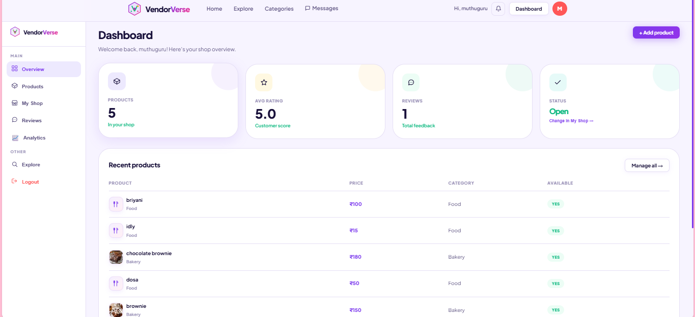
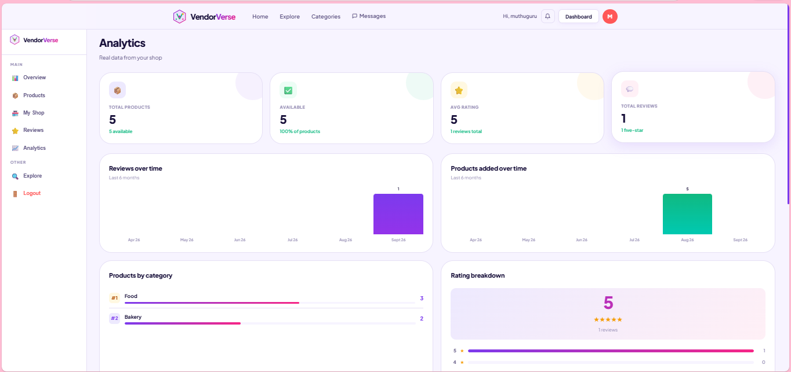
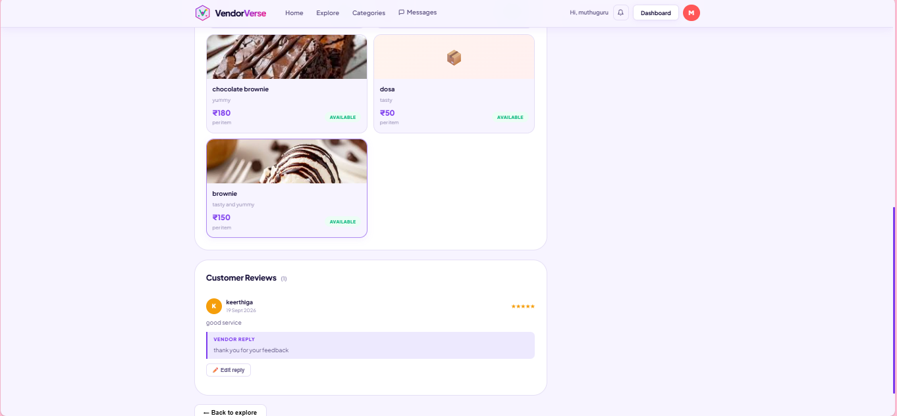

# VendorVerse 🛍️

VendorVerse is a full-stack local marketplace platform that connects customers with nearby vendors — from home chefs and bakers to electricians and tailors. Vendors can list products, manage their shop, and track performance through a dedicated dashboard, while customers can explore vendors by category, chat directly with them, leave reviews, and save favorites to a wishlist.

## ✨ Features

**For Customers**
- Browse vendors by category (Food, Grocery, Tailoring, Beauty, Electronics Repair, Home Repair, and more)
- Explore vendor profiles with product listings, prices, and availability
- Leave ratings and reviews on vendors
- Real-time chat with vendors
- Wishlist to save favorite vendors/products
- In-app notifications for replies, messages, and updates

**For Vendors**
- Vendor dashboard with shop overview (products, ratings, reviews, shop status)
- Product management — add, edit, delete listings with image upload
- Analytics dashboard — total products, average rating, reviews over time, products by category, rating breakdown
- Reply to customer reviews
- Manage incoming customer messages

**Platform-wide**
- JWT-based authentication for secure login sessions
- Image uploads via Cloudinary
- Responsive, modern UI

## 🛠️ Tech Stack

**Frontend**
- React 19 + Vite
- React Router
- Axios
- Framer Motion (animations)
- React Hot Toast (notifications)
- React Icons

**Backend**
- Node.js + Express
- MongoDB with Mongoose
- JWT (jsonwebtoken) for authentication
- bcryptjs for password hashing
- Multer + Cloudinary for image uploads
- CORS-enabled API

**Deployment (config included, not yet live)**
- Frontend: Vercel (`client/vercel.json`)
- Backend: Render (`server/render.yaml`)

## 📸 Screenshots

**Category Browsing**


**Vendor Dashboard**


**Analytics**


**Vendor Detail & Reviews**


## 📂 Project Structure

```
vendorverse/
├── client/                     # React frontend (Vite)
│   ├── src/
│   │   ├── components/         # Reusable UI (Navbar, VendorCard, etc.)
│   │   ├── pages/
│   │   │   ├── Dashboard/      # Overview, Products, MyShop, Reviews, Analytics
│   │   │   ├── Explore/        # Vendor discovery
│   │   │   ├── VendorDetail/   # Single vendor page with reviews
│   │   │   ├── Chat/           # Messaging
│   │   │   ├── Wishlist/       # Saved vendors/products
│   │   │   └── Login.jsx
│   │   ├── sections/           # Landing page sections (Hero, Categories, Testimonials, etc.)
│   │   └── services/           # API service layer (Axios calls)
│   └── vercel.json
├── server/                      # Express backend
│   ├── config/                  # DB connection
│   ├── controllers/             # Route logic (auth, products, users, chat, reviews, notifications)
│   ├── models/                   # Mongoose schemas (User, Product, Review, Message, Notification)
│   ├── routes/                   # API route definitions
│   ├── middleware/                # Auth + upload (Multer/Cloudinary) middleware
│   ├── .env.example
│   └── render.yaml
└── .gitignore
```

## 🚀 Getting Started

### Prerequisites
- Node.js ≥ 18
- MongoDB (local or MongoDB Atlas)
- A Cloudinary account (for image uploads)

### 1. Clone the repo

```bash
git clone https://github.com/Keerthiga-2004/vendorverse.git
cd vendorverse
```

### 2. Backend setup

```bash
cd server
npm install
```

Create a `.env` file in `server/` (copy from `.env.example`):

```
MONGO_URI=your_mongodb_connection_string
JWT_SECRET=your_jwt_secret
CLOUDINARY_CLOUD_NAME=your_cloud_name
CLOUDINARY_API_KEY=your_api_key
CLOUDINARY_API_SECRET=your_api_secret
CLIENT_URL=http://localhost:5173
PORT=5000
```

Run the backend:

```bash
npm run dev
```

The API will run at `http://localhost:5000`.

### 3. Frontend setup

```bash
cd client
npm install
npm run dev
```

The app will run at `http://localhost:5173`.

## 🔌 API Reference

Base URL: `/api`

**Auth** — `/api/auth`
| Method | Endpoint | Description |
|--------|----------|-------------|
| POST | `/register` | Register a new user (customer or vendor) |
| POST | `/login` | Log in and receive a JWT |

**Users / Vendors** — `/api/users`
| Method | Endpoint | Auth | Description |
|--------|----------|------|-------------|
| GET | `/profile` | ✅ | Get logged-in vendor's profile |
| PUT | `/profile` | ✅ | Update vendor profile |
| GET | `/vendors` | — | List all vendors (public) |
| GET | `/vendors/:id` | — | Get a single vendor's public profile |
| GET | `/wishlist` | ✅ | Get logged-in customer's wishlist |
| POST | `/wishlist/:vendorId` | ✅ | Add/remove a vendor from wishlist |

**Products** — `/api/products`
| Method | Endpoint | Auth | Description |
|--------|----------|------|-------------|
| GET | `/` | — | Get all products |
| GET | `/vendor` | ✅ | Get products for the logged-in vendor |
| GET | `/vendor/:vendorId` | — | Get products for a specific public vendor |
| GET | `/analytics` | ✅ | Get analytics for the logged-in vendor |
| GET | `/:id` | — | Get a single product |
| POST | `/` | ✅ | Add a new product (with image upload) |
| PUT | `/:id` | ✅ | Update a product (with image upload) |
| DELETE | `/:id` | ✅ | Delete a product |

**Reviews** — `/api/reviews`
| Method | Endpoint | Auth | Description |
|--------|----------|------|-------------|
| GET | `/:vendorId` | — | Get all reviews for a vendor |
| POST | `/:vendorId` | ✅ | Submit a review for a vendor |
| PUT | `/:reviewId/reply` | ✅ | Vendor replies to a review |
| DELETE | `/:reviewId` | ✅ | Delete a review |

**Chat** — `/api/chat`
| Method | Endpoint | Auth | Description |
|--------|----------|------|-------------|
| GET | `/conversations` | ✅ | Get all conversations for logged-in user |
| GET | `/unread` | ✅ | Get unread message count |
| GET | `/:customerId/:vendorId` | ✅ | Get messages between a customer and vendor |
| POST | `/:vendorId` | ✅ | Send a message to a vendor |

**Notifications** — `/api/notifications`
| Method | Endpoint | Auth | Description |
|--------|----------|------|-------------|
| GET | `/` | ✅ | Get all notifications |
| GET | `/unread-count` | ✅ | Get unread notification count |
| PUT | `/:id/read` | ✅ | Mark one notification as read |
| PUT | `/read-all` | ✅ | Mark all notifications as read |

*✅ = requires JWT auth (Bearer token)*

## 🔮 Future Enhancements

- [ ] Deploy live to Vercel + Render
- [ ] Real-time chat with WebSockets/Socket.IO (currently polling-based)
- [ ] Payment gateway integration for in-app orders
- [ ] Search and filters on the Explore page (price, rating, distance)
- [ ] Map-based vendor discovery (location search)
- [ ] Push notifications
- [ ] Vendor verification/badges
- [ ] Improved UI/UX polish and mobile responsiveness pass

## 👩‍💻 Author

**Keerthiga**
[GitHub](https://github.com/Keerthiga-2004)

## 📄 License

This project is available under the [MIT License](LICENSE).
